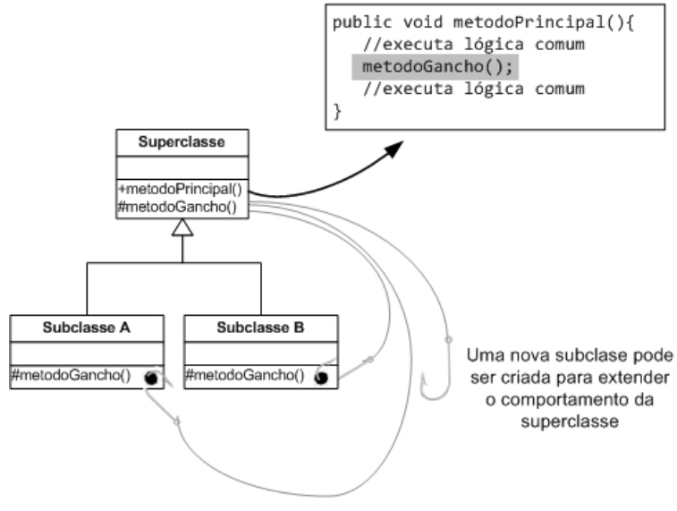

#Hook Methods

Um importante uso que pode ser feito da herança é para permitir a especialização de comportamento. Dessa forma, a superclasse pode fornecer uma base para uma determinada funcionalidade, a qual invoca um método que somente é de!nido pela superclasse. Esse método funciona como um ponto de extensão do sistema é chamado de método-gancho, ou em inglês, **hook method**.

A superclasse possui um método principal público que é invocado pelos seus clientes. Esse mé-
todo delega parte de sua execução para o hook method, que é um método abstrato que deve ser implementado pela subclasse. Ele funciona como um “gancho” no qual uma nova lógica de execução para a classe pode ser “pendurada”. Cada subclasse o implementa provendo uma lógica diferente. Como essa lógica pode ser invocada a partir do mesmo método público, de!nido na superclasse, os hook methods permitem que o objeto possua um comportamento diferente de acordo com a subclasse instanciada.

Essa prática é muito utilizada em frameworks para permitir que as aplicações possam especializar seu comportamento para seus requisitos.

A aplicação deve estender essa classe e implementar o hook method de forma a inserir o comportamento específco de seu domínio.

**REFERÊNCIAS**
 
 
GUERRA Eduardo. **Design Patterns com Java:** Projeto orientado a objetos guiado por padrões. São Paulo: Casa do Código, 2013.