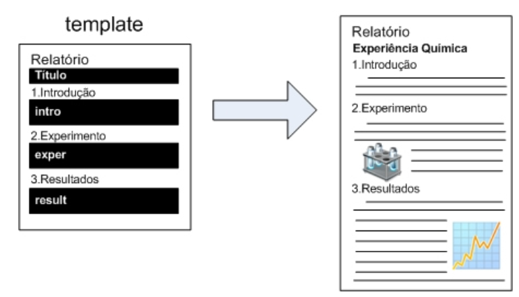
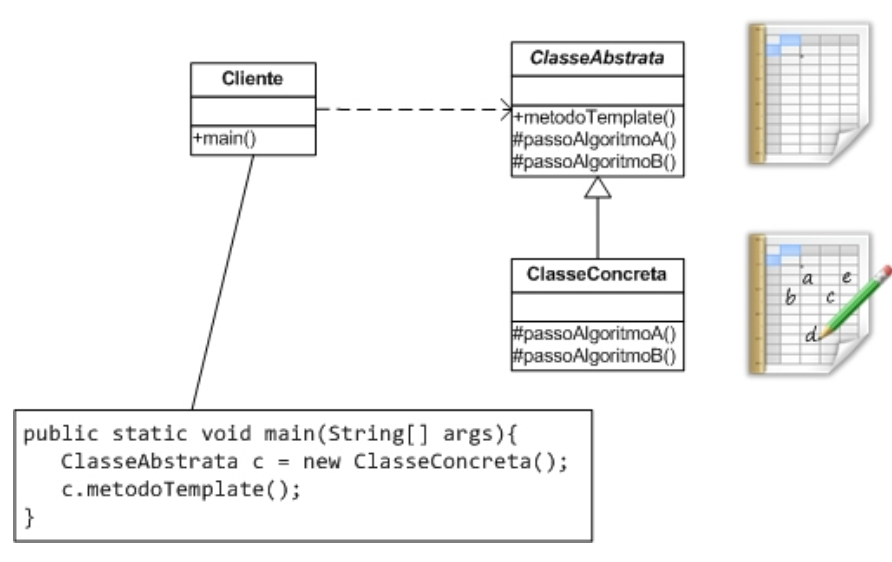

#Template Method

Este padrão é aplicável quando se deseja de!nir um algoritmo geral, que estabelece uma série de passos para cumprir um requisito da aplicação. Porém, seus passos podem variar e é desejável que a estrutura da implementação forneça uma forma para que eles sejam facilmente substituídos.

Imagine, por exemplo, como seria se fôssemos de!nir um algoritmo para as pessoas acordarem e irem ao trabalho. Esse algoritmo envolveria ações como acordar, ir ao banheiro, comer alguma coisa, trocar de roupa e se locomover até o trabalho. Dependendo da pessoa cada um dos passos pode ser diferente, como o tipo de roupa que colocam para ir ao trabalho ou o que comem pela manhã. Na locomoção ao trabalho, alguns podem ir de transporte público, outros podem ir em seu carro e até mesmo a pé ou de bicicleta. Por mais que cada um dos passos seja diferente, o algoritmo que os utiliza acaba sendo o mesmo.

#Qual a diferença entre Hook Methods e o Template Method?

Muitas pessoas nesse ponto podem estar achando que Hook Methods e o padrão **Template Method** são a mesma coisa. A grande diferença é que os Hook Methods são uma técnica para permitir a extensão de comportamento e o **Template Method**, como um padrão, é uma solução para um problema mais especí!co. Seria correto dizer que o **Template Method** utiliza Hook Methods em sua solução. O que é importante perceber é que o conceito de Hook Method é mais geral e inclusive é utilizado por outros padrões.
 
 
**REFERÊNCIAS**
 
 
GUERRA Eduardo. **Design Patterns com Java:** Projeto orientado a objetos guiado por padrões. São Paulo: Casa do Código, 2013.